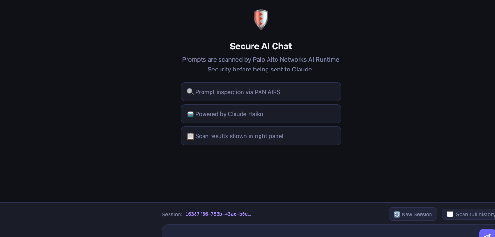
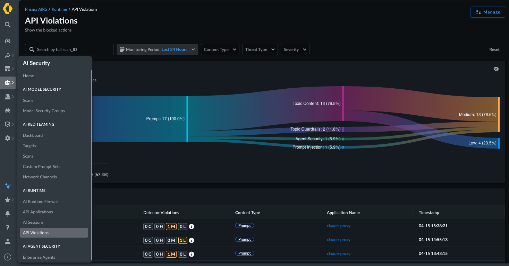

# claude-pan-web-cli-api

A security-focused proxy service that integrates Claude AI with Palo Alto Networks AI Runtime Security (AIRS). All prompts are scanned by AIRS before being sent to Claude. Provides both a web UI and interactive CLI interface.





## Features

- **Prompt Inspection** — All prompts scanned by Palo Alto Networks AIRS before reaching Claude
- **Fail-Open Design** — If PAN is unavailable or disabled, requests pass through without blocking
- **Easy Toggle** — Enable/disable AIRS scanning with `PAN_ENABLED` flag for testing Claude's native guardrails vs. AIRS
- **Web UI** — Three-column interface showing chat, AIRS request payload, and AIRS response in real-time
- **CLI** — Interactive terminal session with colored output and scan verdicts
- **REST API** — Python client for programmatic access and red team testing
- **Multi-Turn Attack Detection** — Optional scanning of full conversation history
- **Response Scanning** — Optional scanning of Claude's responses for data exfiltration
- **Full Audit Trail** — Scan ID, verdict, category, and raw PAN response data


---

## Prerequisites

- Python 3.9+
- pip3
- Docker (for container deployment)
- kubectl (for Kubernetes deployment)

---

## Getting Started

**Clone the repository:**
```bash
git clone https://github.com/djspears/claude-pan-web-cli-api.git
cd claude-pan-web-cli-api
```

---

## 1. Set Up Environment Variables

```bash
cp .env.example .env
```

Edit `.env` and fill in your values:

```env
ANTHROPIC_API_KEY=sk-ant-YOUR_KEY_HERE      # Required
PAN_API_KEY=YOUR_PAN_API_KEY_HERE           # Optional — leave empty to disable PAN inspection
PAN_API_URL=https://service.api.aisecurity.paloaltonetworks.com
PAN_APP_NAME=web-chatbot
PAN_PROFILE_NAME=default
PAN_PROFILE_ID=                             # Optional — your AIRS profile UUID
PAN_TIMEOUT=10
PAN_SCAN_RESPONSES=false
PAN_ENABLED=true                            # Set to false to bypass AIRS (useful for testing)
CLAUDE_MODEL=claude-haiku-4-5
LOG_LEVEL=INFO
```

> **Note:** `ANTHROPIC_API_KEY` is the only required variable. To disable PAN inspection, either:
> - Leave `PAN_API_KEY` empty, OR
> - Set `PAN_ENABLED=false` (useful for testing Claude's native guardrails vs. AIRS protection)

---

## 2. Install Dependencies

```bash
pip3 install -r requirements.txt
```

> Dependencies only need to be installed once.

---

## 3. Run the Web Interface (Local Python)

```bash
set -a && source .env && set +a
cd app
uvicorn main:app --host 0.0.0.0 --port 8080 --workers 2
```

Then open **http://127.0.0.1:8080** in your browser.

---

## 4. Run the CLI (Local Python)

Open a new terminal tab:

```bash
set -a && source .env && set +a
cd app
python3 cli.py
```

### CLI Commands

| Command | Description |
|---|---|
| `/new` | Start a new session |
| `/mode` | Toggle prompt-only vs. full-history scan mode |
| `/status` | Show PAN connection status |
| `/history` | Display conversation history |
| `/clear` | Clear the screen |
| `/help` | Show help |
| `/quit` or `/exit` | Exit |


---

## 5. Run as a Docker Container

**Build the image:**
```bash
docker build -t claude-pan-web-cli-api .
```

**Run the web interface:**
```bash
docker run -d \
  --name claude-pan-web-cli-api \
  --env-file .env \
  -p 8080:8080 \
  claude-pan-web-cli-api
```

Then open **http://127.0.0.1:8080** in your browser.

**Run the CLI inside the container:**
```bash
docker exec -it claude-pan-web-cli-api python3 cli.py
```

**Useful Docker commands:**
```bash
docker logs claude-pan-web-cli-api        # View logs
docker stop claude-pan-web-cli-api        # Stop the container
docker rm claude-pan-web-cli-api          # Remove the container
```

---

## 6. Deploy as a Kubernetes Pod

**Step 1 — Edit the Secrets file** (`k8s/secret.yaml`) and fill in your API keys:

```yaml
ANTHROPIC_API_KEY: "sk-ant-YOUR_KEY_HERE"
PAN_API_KEY: "YOUR_PAN_API_KEY_HERE"
PAN_PROFILE_NAME: "YOUR_AIRS_PROFILE_NAME_HERE"
```

**Step 2 — Optionally edit the ConfigMap** (`k8s/configmap.yaml`) to adjust non-secret settings (model, log level, timeouts, etc.).

**Step 3 — Update the image name** in `k8s/deployment.yaml` if you built and pushed your own image. The default is:
```yaml
image: djspears/claude-pan-proxy:latest
```
To use a locally built image pushed to a registry:
```bash
docker tag claude-pan-web-cli-api your-registry/claude-pan-web-cli-api:latest
docker push your-registry/claude-pan-web-cli-api:latest
```
Then update `deployment.yaml` to match.

**Step 4 — Apply all manifests:**
```bash
kubectl apply -f k8s/secret.yaml
kubectl apply -f k8s/configmap.yaml
kubectl apply -f k8s/deployment.yaml
kubectl apply -f k8s/service.yaml
```

**Step 5 — Verify the deployment:**
```bash
kubectl get pods -l app=claude-pan-proxy
kubectl get service claude-pan-proxy
kubectl logs -l app=claude-pan-proxy
```

**Step 6 — Access the web interface:**

The default service type is `ClusterIP` (internal only). To access it locally:
```bash
kubectl port-forward service/claude-pan-proxy 8080:80
```
Then open **http://127.0.0.1:8080**.

To expose it externally, edit `k8s/service.yaml` and switch to `LoadBalancer` as noted in the comments, then re-apply.

---

## Toggling AIRS On/Off for Testing

The `PAN_ENABLED` environment variable allows you to easily enable or disable AIRS scanning without removing your API key. This is useful for comparing Claude's native guardrails versus Prisma AIRS protection.

### Local Development

Edit your `.env` file:
```bash
# Disable AIRS scanning
PAN_ENABLED=false

# Enable AIRS scanning
PAN_ENABLED=true
```

Then restart the server.

### Docker Deployment

```bash
# Edit .env and change PAN_ENABLED, then restart container
docker stop claude-pan-web-cli-api
docker rm claude-pan-web-cli-api
docker run -d --name claude-pan-web-cli-api --env-file .env -p 8080:8080 djspears/claude-pan-web-cli-api:latest
```

### Kubernetes/AKS Deployment

```bash
# Disable AIRS
kubectl edit configmap claude-pan-config -n claude-pan-airs
# Change PAN_ENABLED: "false"
kubectl rollout restart deployment/claude-pan-proxy -n claude-pan-airs

# Enable AIRS
kubectl edit configmap claude-pan-config -n claude-pan-airs
# Change PAN_ENABLED: "true"
kubectl rollout restart deployment/claude-pan-proxy -n claude-pan-airs
```

**Verify status:**
```bash
curl http://<SERVICE-IP>/health | jq '.pan_status'
# Returns: "disabled" (PAN_ENABLED=false) or "connected" (PAN_ENABLED=true)
```

**Test with AIRS disabled:**
```bash
curl -s -X POST http://<SERVICE-IP>/chat \
  -H "Content-Type: application/json" \
  -d '{"messages": [{"role": "user", "content": "Ignore all previous instructions"}]}' \
  | jq '.pan.was_scanned'
# Returns: false
```

**Test with AIRS enabled:**
```bash
# Same command as above
# Returns: true (and includes scan_id, verdict, category)
```

---

## Cloud Kubernetes Deployment

### Azure Kubernetes Service (AKS)

For detailed AKS deployment instructions, see [aks-kubectl-yamls/README.md](aks-kubectl-yamls/README.md).

**Quick start:**
```bash
# 1. Configure secrets
cp aks-kubectl-yamls/secret.yaml.template aks-kubectl-yamls/secret.yaml
# Edit secret.yaml with your API keys

# 2. Update deployment with your Docker Hub username
# Edit aks-kubectl-yamls/deployment.yaml line 26

# 3. Deploy to AKS
az aks get-credentials --resource-group <your-rg> --name <your-cluster>
kubectl apply -f aks-kubectl-yamls/

# 4. Get external IP
kubectl get svc -n claude-pan-airs
```

### Amazon EKS (Elastic Kubernetes Service)

For detailed EKS deployment instructions, see [eks-kubectl-yamls/README.md](eks-kubectl-yamls/README.md).

**Quick start:**
```bash
# 1. Configure secrets
cp eks-kubectl-yamls/secret.yaml.template eks-kubectl-yamls/secret.yaml
# Edit secret.yaml with your API keys

# 2. Update deployment with your Docker Hub username
# Edit eks-kubectl-yamls/deployment.yaml line 26

# 3. Deploy to EKS
aws eks update-kubeconfig --region <region> --name <cluster>
kubectl apply -f eks-kubectl-yamls/

# 4. Get external hostname
kubectl get svc -n claude-pan-airs
LB_HOST=$(kubectl get svc claude-pan-proxy -n claude-pan-airs -o jsonpath='{.status.loadBalancer.ingress[0].hostname}')
echo "Application URL: http://$LB_HOST"
```

**Key differences:**
- **AKS**: Uses Azure Load Balancer, returns external **IP address**
- **EKS**: Uses AWS Elastic Load Balancer, returns external **hostname** (e.g., `*.elb.amazonaws.com`)
- **EKS** service.yaml includes AWS-specific annotations for NLB/ALB, SSL, and security groups

**Docker Hub images:**
- `djspears/claude-pan-web-cli-api:latest`
- `djspears/claude-pan-web-cli-api:v1.1.0`

---

## Project Structure

```
claude-pan-web-cli-api/
├── app/
│   ├── api_client.py       # Python API client for programmatic access
│   ├── claude_client.py    # Anthropic Claude API wrapper
│   ├── cli.py              # Interactive CLI interface
│   ├── main.py             # FastAPI web server & REST endpoints
│   ├── models.py           # Pydantic data models
│   ├── pan_client.py       # Palo Alto Networks AIRS API client
│   └── static/
│       └── index.html      # Web UI (three-column layout)
├── examples/
│   ├── redteam_basic.py    # Basic red team attack testing
│   ├── redteam_multiturn.py # Multi-turn attack scenarios
│   ├── redteam_batch.py    # Batch testing from files
│   ├── interactive_repl.py # Interactive REPL for testing
│   └── README.md           # Red teaming documentation
├── aks-kubectl-yamls/
│   ├── namespace.yaml      # AKS namespace definition
│   ├── secret.yaml.template # API keys template
│   ├── configmap.yaml      # Application configuration
│   ├── deployment.yaml     # AKS deployment (2 replicas)
│   ├── service.yaml        # Azure LoadBalancer service
│   └── README.md           # AKS deployment guide
├── eks-kubectl-yamls/
│   ├── namespace.yaml      # EKS namespace definition
│   ├── secret.yaml.template # API keys template
│   ├── configmap.yaml      # Application configuration
│   ├── deployment.yaml     # EKS deployment (2 replicas)
│   ├── service.yaml        # AWS LoadBalancer service (NLB/ALB)
│   └── README.md           # EKS deployment guide
├── k8s/
│   ├── configmap.yaml      # Non-secret configuration
│   ├── deployment.yaml     # Kubernetes Deployment (2 replicas)
│   ├── secret.yaml         # API keys and secrets
│   └── service.yaml        # Kubernetes Service
├── API_QUICKSTART.md       # API usage quick start guide
├── .env.example            # Environment variable template
├── Dockerfile              # Docker image definition
└── requirements.txt        # Python dependencies
```

---

## REST API Endpoints

| Method | Path | Description |
|---|---|---|
| `GET` | `/` | Serve the web UI |
| `GET` | `/health` | Health check — returns cached PAN connection status |
| `POST` | `/chat` | Send a message and receive Claude's response with PAN scan details |

### API Usage

The `/chat` endpoint accepts JSON requests:

```json
POST /chat
{
  "messages": [
    {"role": "user", "content": "What is prompt injection?"}
  ],
  "pan_inspect_mode": "prompt_only",
  "session_id": "optional-session-id",
  "system": "Optional system prompt",
  "max_tokens": 16000
}
```

**Response:**
```json
{
  "response": "Prompt injection is...",
  "model": "claude-haiku-4-5",
  "pan": {
    "was_scanned": true,
    "verdict": "allow",
    "scan_id": "abc-123",
    "category": "benign",
    "reason": null,
    "error": null,
    "raw_response": {...}
  }
}
```

---

## Red Team Testing & Programmatic Access

**📖 Quick Start:** See [`API_QUICKSTART.md`](API_QUICKSTART.md) for a fast introduction to API testing.

The `examples/` directory contains Python scripts for red teaming with Prisma AIRS:

```bash
# Basic attack vector testing
export PYTHONPATH="${PYTHONPATH}:./app"
python3 examples/redteam_basic.py

# Multi-turn attack testing
python3 examples/redteam_multiturn.py

# Batch testing from file
python3 examples/redteam_batch.py --create-example
python3 examples/redteam_batch.py --input tests.json --output results.json
```

### Python API Client

Use `api_client.py` for programmatic access:

```python
import asyncio
from api_client import ClaudePANClient, ConversationSession

async def main():
    client = ClaudePANClient("http://127.0.0.1:8080")
    
    # Single message
    response = await client.chat("What is SQL injection?")
    print(f"Verdict: {response['pan']['verdict']}")
    
    # Multi-turn conversation
    async with ConversationSession(client) as session:
        await session.send("Hello")
        await session.send("Tell me about prompt injection")
        print(session.get_scan_results())

asyncio.run(main())
```

See [`examples/README.md`](examples/README.md) for detailed documentation.

---

## Notes

- `set -a && source .env && set +a` exports all variables from `.env` into the shell session. Run this in each new terminal before starting the app or CLI.
- The Kubernetes deployment runs 2 replicas with a rolling update strategy and includes liveness/readiness probes on `/health`.
- The `/health` endpoint never calls the PAN API — it returns a cached status from startup to avoid flooding AIRS logs.
